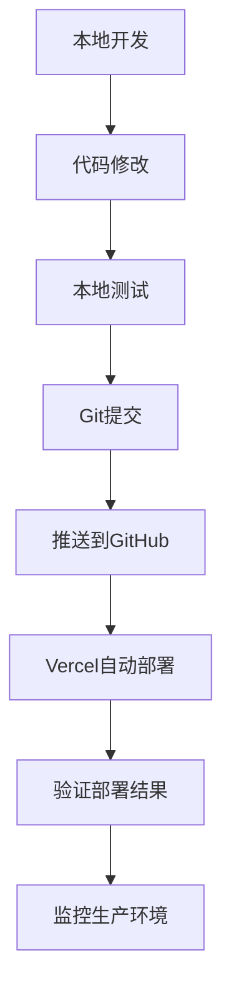

# 宝得利门窗系统 - Vercel全栈部署指南

## 🚀 方案C：完全使用Vercel

### 架构概述
```
┌─────────────────┐    ┌──────────────────┐    ┌─────────────────┐
│   前端静态托管   │    │ Serverless函数    │    │ Vercel Postgres │
│   (Vue.js)      │───▶│   (API Routes)   │───▶│   数据库        │
│                 │    │                  │    │                 │
└─────────────────┘    └──────────────────┘    └─────────────────┘
```

### 📁 项目结构调整

```
宝得利订购网站/
├── api/                    # Vercel API Routes (新增)
│   ├── admin/
│   │   ├── login.js
│   │   └── stats.js
│   ├── products/
│   │   ├── index.js
│   │   └── [id].js
│   ├── orders/
│   │   ├── index.js
│   │   └── [id].js
│   ├── users/
│   │   ├── login.js
│   │   ├── register.js
│   │   └── profile.js
│   ├── upload/
│   │   └── image.js
│   ├── contracts/
│   │   ├── index.js
│   │   └── [id].js
│   ├── chat/
│   │   └── messages.js
│   └── health.js
├── lib/                    # 共享工具库 (新增)
│   ├── database.js
│   ├── auth.js
│   ├── utils.js
│   └── models/
├── client/                 # 前端代码 (保持不变)
├── server/                 # 原Express代码 (保留作参考)
└── vercel.json            # Vercel配置 (更新)
```

## 🔧 实施步骤

### Step 1: 创建共享数据库连接

### Step 2: 重构身份验证中间件

### Step 3: 转换API路由

### Step 4: 配置文件上传

### Step 5: 更新前端配置

### Step 6: 部署配置

## 📊 Vercel服务配置

### 数据库服务
- Vercel Postgres
- 连接池管理
- SSL连接

### 存储服务
- Vercel Blob Storage
- 图片和文件上传
- CDN加速

### 函数配置
- 运行时：Node.js 18
- 内存：1024MB
- 超时：10秒

## 🎯 优势对比

**相比分离部署的优势：**
1. ✅ 统一部署和管理
2. ✅ 更好的性能（同区域）
3. ✅ 简化的域名和SSL配置
4. ✅ 统一的监控和日志

**挑战：**
1. ⚠️ Serverless函数有冷启动延迟
2. ⚠️ 需要重构现有代码
3. ⚠️ 文件存储需要特殊处理
4. ⚠️ 调试相对复杂

## 💰 成本估算

**免费额度：**
- Vercel Hobby: 免费
- Functions: 100GB-Hrs/月
- Bandwidth: 100GB/月
- Postgres: 60小时计算时间/月


## 🚀 快速部署指南

### 前置条件
- GitHub账户
- Vercel账户
- Node.js 18+ 本地环境

### Step 1: 准备代码仓库

```bash
# 提交所有新的API文件到Git
git add .
git commit -m "重构为Vercel Serverless Functions"
git push origin main
```

### Step 2: 创建Vercel项目

1. 访问 [vercel.com](https://vercel.com) 并登录
2. 点击 "New Project"
3. 导入您的GitHub仓库
4. 项目设置保持默认（Vercel会自动检测配置）

### Step 3: 配置Vercel Postgres数据库

1. 在Vercel项目面板中，点击 "Storage" 标签
2. 点击 "Create Database"
3. 选择 "Postgres"
4. 创建完成后，系统会自动设置 `POSTGRES_URL` 环境变量

### Step 4: 设置环境变量

在Vercel项目设置中添加以下环境变量：

```env
POSTGRES_URL=vercel-postgres://... (自动设置)
JWT_SECRET=your-super-secret-jwt-key-here
ADMIN_USERNAME=admin
ADMIN_PASSWORD=your-secure-admin-password
BLOB_READ_WRITE_TOKEN=your-vercel-blob-token (可选)
```

### Step 5: 数据迁移

在本地运行数据迁移：

```bash
# 设置环境变量（从Vercel复制）
export POSTGRES_URL="vercel-postgres://..."

# 安装依赖
npm install

# 运行数据迁移
npm run migrate
```

### Step 6: 配置部署文件 (vercel.json)

项目根目录的 `vercel.json` 配置文件：

```json
{
  "version": 2,
  "buildCommand": "cd client && npm install && npm run build",
  "outputDirectory": "client/dist",
  "installCommand": "npm install @vercel/postgres @vercel/blob jsonwebtoken bcryptjs",
  "functions": {
    "api/**/*.js": {
      "runtime": "@vercel/node@3.0.5",
      "memory": 1024,
      "maxDuration": 10
    }
  },
  "rewrites": [
    {
      "source": "/api/(.*)",
      "destination": "/api/$1"
    }
  ],
  "headers": [
    {
      "source": "/api/(.*)",
      "headers": [
        {
          "key": "Access-Control-Allow-Origin",
          "value": "*"
        },
        {
          "key": "Access-Control-Allow-Methods",
          "value": "GET, POST, PUT, DELETE, OPTIONS"
        },
        {
          "key": "Access-Control-Allow-Headers",
          "value": "Content-Type, Authorization"
        }
      ]
    }
  ]
}
```

**配置说明：**
- ✅ **使用 `rewrites` 而非 `routes`**：新版本配置格式，避免属性冲突
- ✅ **正确的运行时版本**：`@vercel/node@3.0.5` 而非 `nodejs18.x`
- ✅ **移除 `builds`**：Vercel自动检测并构建函数
- ✅ **包含CORS头信息**：支持跨域API调用
- ✅ **自动依赖安装**：确保部署时安装必要的依赖

**常见配置错误及修复：**
1. ❌ `functions` 与 `builds` 冲突 → 移除 `builds`
2. ❌ `routes` 与 `headers` 冲突 → 使用 `rewrites`
3. ❌ 运行时版本格式错误 → 使用 `@vercel/node@3.0.5`

### Step 7: 部署

```bash
# 首次部署
vercel --prod

# 或者推送代码自动触发部署
git push origin main
```

### Step 8: 验证部署

部署完成后测试以下端点：

```bash
# 健康检查
curl https://your-app.vercel.app/api/health

# 获取商品列表
curl https://your-app.vercel.app/api/products

# 管理员登录
curl -X POST https://your-app.vercel.app/api/admin/login \
  -H "Content-Type: application/json" \
  -d '{"username":"admin","password":"your-password"}'
```

## 📊 项目结构说明

### 新增的Serverless Functions
```
api/
├── health.js                 # 健康检查
├── admin/
│   ├── login.js              # 管理员登录
│   └── stats.js              # 统计数据
└── products/
    └── index.js              # 商品管理
```

### 共享库
```
lib/
├── database.js               # 数据库连接
├── auth.js                   # 身份验证
└── utils.js                  # 工具函数
```

## 🔧 开发工作流

### 本地开发
```bash
# 启动本地开发服务器
vercel dev

# 访问 http://localhost:3000
```

### 部署更新
```bash
# 部署到预览环境
vercel

# 部署到生产环境
vercel --prod
```

## 🎯 API端点列表

### 公开端点
- `GET /api/health` - 健康检查
- `GET /api/products` - 获取商品列表
- `POST /api/users/register` - 用户注册
- `POST /api/users/login` - 用户登录

### 管理员端点
- `POST /api/admin/login` - 管理员登录
- `GET /api/admin/stats` - 获取统计数据
- `POST /api/products` - 创建商品
- `PUT /api/products/:id` - 更新商品
- `DELETE /api/products/:id` - 删除商品

### 用户端点
- `GET /api/users/profile` - 获取用户信息
- `POST /api/orders` - 创建订单
- `GET /api/orders/user` - 获取用户订单

## 🚨 常见部署问题及解决方案

### 配置文件问题

**问题1：Function Runtimes must have a valid version**
```
❌ "runtime": "nodejs18.x"
✅ "runtime": "@vercel/node@3.0.5"
```

**问题2：functions与builds属性冲突**
```
❌ 同时使用 "builds" 和 "functions"
✅ 只使用 "functions"，移除 "builds"
```

**问题3：routes与headers属性冲突**
```
❌ 同时使用 "routes" 和 "headers"
✅ 使用 "rewrites" 替代 "routes"
```

### 数据库连接问题

**问题：无法连接到PostgreSQL**
```bash
# 检查环境变量
vercel env ls

# 确保POSTGRES_URL已设置
vercel env add POSTGRES_URL
```

### API调用失败

**问题：CORS错误**
- 确保 `vercel.json` 中包含CORS头信息
- 检查前端API基础URL配置

**问题：函数超时**
- 检查数据库查询是否过慢
- 优化代码性能
- 考虑增加 `maxDuration` 配置

### 调试命令

```bash
# 查看函数日志
vercel logs

# 本地调试
vercel dev --debug

# 检查构建日志
vercel inspect [deployment-url]
```

## ⚠️ 注意事项

### Serverless限制
1. **冷启动延迟**: 首次访问可能需要1-3秒
2. **执行时间限制**: 最大10秒执行时间
3. **内存限制**: 1024MB内存限制
4. **并发限制**: 免费版有并发限制

### 最佳实践
1. **数据库连接**: 使用连接池避免连接数过多
2. **错误处理**: 完善的错误处理和日志记录
3. **缓存策略**: 合理使用缓存减少数据库查询
4. **监控**: 设置Vercel Analytics监控性能

## 🔄 后续扩展

### 添加新API
1. 在 `api/` 目录创建新的JS文件
2. 使用 `apiHandler` 包装器
3. 部署后自动生效

### 文件上传
```javascript
// api/upload/image.js
import { put } from '@vercel/blob';

export default apiHandler(async (req, res) => {
  if (req.method === 'POST') {
    const blob = await put(filename, file, { access: 'public' });
    return createApiResponse(true, { url: blob.url });
  }
});
```

### 定时任务
```javascript
// api/cron/cleanup.js
export default async function handler(req, res) {
  // 定时清理任务
  res.status(200).json({ success: true });
}
```

## 💡 性能优化建议

1. **数据库优化**
   - 添加适当的索引
   - 使用查询优化
   - 实施读写分离

2. **缓存策略**
   - 静态数据缓存
   - API响应缓存
   - CDN缓存

3. **监控和报警**
   - 错误率监控
   - 响应时间监控
   - 资源使用监控

## 🔄 日常更新操作指南

现在您的网站已成功部署，以下是完整的日常更新操作流程：

### 📋 更新流程总览



### 🛠️ Step 1: 本地开发环境

#### 启动本地开发服务器
```bash
# 方式1: 使用Vercel本地环境 (推荐)
vercel dev
# 访问: http://localhost:3000

# 方式2: 分别启动前后端 (调试用)
# 终端1: 启动后端
cd server && npm run dev

# 终端2: 启动前端  
cd client && npm run dev
```

#### 环境变量配置
```bash
# 创建本地环境变量文件
cp .env.local.example .env.local

# 编辑环境变量
# JWT_SECRET=your-local-jwt-secret
# ADMIN_USERNAME=admin
# ADMIN_PASSWORD=admin123
```

### ✏️ Step 2: 代码修改操作

#### 前端修改 (Vue.js)
```bash
# 页面修改
vi client/src/views/Home.vue          # 首页
vi client/src/views/ProductDetail.vue # 商品详情
vi client/src/views/Cart.vue          # 购物车

# 组件修改
vi client/src/components/Header.vue   # 头部组件
vi client/src/components/ProductCard.vue # 商品卡片

# 样式修改
vi client/src/style.css               # 全局样式

# 路由修改
vi client/src/router/index.js         # 路由配置
```

#### 后端API修改 (Serverless Functions)
```bash
# 商品相关API
vi api/products/index.js              # 商品列表、创建
vi api/products/[id].js               # 商品详情、更新、删除

# 用户相关API
vi api/users/login.js                 # 用户登录
vi api/users/register.js              # 用户注册

# 管理员API
vi api/admin/login.js                 # 管理员登录
vi api/admin/stats.js                 # 统计数据

# 共享库修改
vi lib/database.js                    # 数据库连接
vi lib/auth.js                        # 身份验证
vi lib/utils.js                       # 工具函数
```

### 🧪 Step 3: 本地测试

#### 前端测试
```bash
# 开发服务器测试
vercel dev
# 浏览器访问: http://localhost:3000

# 构建测试
cd client
npm run build                         # 检查构建是否成功
npm run preview                       # 预览构建结果
```

#### API测试
```bash
# 健康检查
curl http://localhost:3000/api/health

# 商品API测试
curl http://localhost:3000/api/products
curl -X POST http://localhost:3000/api/products \
  -H "Content-Type: application/json" \
  -d '{"name":"测试商品","price":100}'

# 用户API测试
curl -X POST http://localhost:3000/api/users/login \
  -H "Content-Type: application/json" \
  -d '{"phone":"13800138000","password":"123456"}'
```

### 💾 Step 4: Git提交流程

#### 标准Git工作流
```bash
# 1. 查看更改状态
git status

# 2. 添加更改文件
git add .                             # 添加所有更改
# 或者
git add client/src/views/Home.vue     # 只添加特定文件

# 3. 提交更改
git commit -m "feat: 更新首页产品展示布局"

# 4. 推送到GitHub
git push origin main
```

#### 提交信息规范
```bash
# 功能新增
git commit -m "feat: 添加商品搜索功能"

# Bug修复
git commit -m "fix: 修复购物车数量计算错误"

# 样式更新
git commit -m "style: 优化移动端页面布局"

# 文档更新
git commit -m "docs: 更新API使用说明"

# 重构代码
git commit -m "refactor: 重构用户认证逻辑"
```

### 🚀 Step 5: 自动部署

推送代码后，Vercel会自动执行以下流程：

```bash
# Vercel自动部署流程
1. 检测到GitHub推送
2. 下载最新代码
3. 安装依赖包
4. 构建前端项目
5. 部署Serverless Functions
6. 更新生产环境
7. 发送部署通知
```

#### 部署状态监控
```bash
# 查看部署状态
vercel ls                             # 列出所有部署

# 查看部署日志
vercel logs [deployment-url]          # 查看特定部署日志

# 查看函数日志
vercel logs --follow                  # 实时查看日志
```

### 📊 Step 6: 验证部署结果

#### 生产环境测试
```bash
# 替换 your-app.vercel.app 为您的实际域名

# 健康检查
curl https://your-app.vercel.app/api/health

# 功能测试
curl https://your-app.vercel.app/api/products
curl -X POST https://your-app.vercel.app/api/admin/login \
  -H "Content-Type: application/json" \
  -d '{"username":"admin","password":"your-password"}'
```

#### 前端页面检查
- ✅ 页面加载正常
- ✅ 样式显示正确
- ✅ 功能交互正常
- ✅ 移动端兼容性

### 🎯 常见更新场景

#### 场景1: 更新商品信息
```bash
# 1. 修改商品管理页面
vi client/src/views/ProductAdmin.vue

# 2. 更新商品API
vi api/products/index.js

# 3. 测试功能
vercel dev
# 测试添加、编辑、删除商品

# 4. 提交部署
git add .
git commit -m "feat: 优化商品管理界面和API"
git push origin main
```

#### 场景2: 修复Bug
```bash
# 1. 定位问题
# 查看Vercel日志或用户反馈

# 2. 修复代码
vi client/src/views/Cart.vue  # 假设购物车有问题

# 3. 本地验证修复
vercel dev
# 重现问题并验证修复

# 4. 紧急部署
git add .
git commit -m "fix: 修复购物车商品数量更新问题"
git push origin main
```

#### 场景3: 添加新功能
```bash
# 1. 创建功能分支 (推荐)
git checkout -b feature/user-favorites

# 2. 开发新功能
# 添加收藏功能相关文件
touch client/src/views/UserFavorites.vue
touch api/favorites/index.js

# 3. 开发完成后合并
git add .
git commit -m "feat: 添加用户收藏功能"
git checkout main
git merge feature/user-favorites
git push origin main
```

#### 场景4: 数据库更新
```bash
# 1. 修改数据库模型
vi lib/database.js

# 2. 更新迁移脚本
vi scripts/migrateToVercel.js

# 3. 在Vercel控制台执行迁移
# 或通过API触发迁移

# 4. 提交代码更改
git add .
git commit -m "db: 添加用户收藏表"
git push origin main
```

### 🛡️ 紧急回滚操作

#### 方式1: Vercel Dashboard回滚
```bash
1. 登录 https://vercel.com/dashboard
2. 选择项目 > 查看部署历史
3. 找到稳定版本，点击 "Promote to Production"
```

#### 方式2: Git回滚
```bash
# 查看提交历史
git log --oneline -10

# 回滚到指定版本 (谨慎使用)
git reset --hard <stable-commit-hash>
git push -f origin main
```

### 🔧 环境变量更新

#### 更新生产环境变量
```bash
1. 访问 Vercel Dashboard
2. 项目设置 > Environment Variables
3. 更新或添加变量:
   - JWT_SECRET
   - ADMIN_PASSWORD
   - POSTGRES_URL
   - 其他敏感配置

4. 重新部署项目使变量生效
```

### 📱 快速更新脚本

创建快速更新脚本简化操作：

```bash
# 创建更新脚本
cat > quick-update.sh << 'EOF'
#!/bin/bash
echo "🔍 检查状态..."
git status

echo "📝 添加更改..."
git add .

echo "请输入提交信息:"
read -p "提交描述: " message

if [ -z "$message" ]; then
    message="Update: $(date '+%Y-%m-%d %H:%M:%S')"
fi

echo "💾 提交更改..."
git commit -m "$message"

echo "🚀 推送到GitHub..."
git push origin main

echo "✅ 完成！查看部署状态: https://vercel.com/dashboard"
EOF

chmod +x quick-update.sh

# 使用方法
./quick-update.sh
```

### 📈 性能监控

#### 定期检查项目
- 🔍 **Vercel Analytics**: 查看页面访问数据
- 📊 **Functions日志**: 监控API调用情况
- 🚨 **错误追踪**: 及时发现和修复问题
- 💰 **资源使用**: 监控免费额度使用情况

#### 优化建议
```bash
# 前端优化
- 图片压缩和懒加载
- 代码分割和缓存
- CSS和JS压缩

# 后端优化  
- 数据库查询优化
- API响应缓存
- 函数冷启动优化
```

🎉 恭喜！您已成功将Express应用重构为Vercel Serverless Functions！ 

现在您拥有了完整的网站更新操作流程，可以轻松维护和扩展您的宝得利门窗系统！